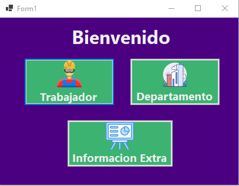
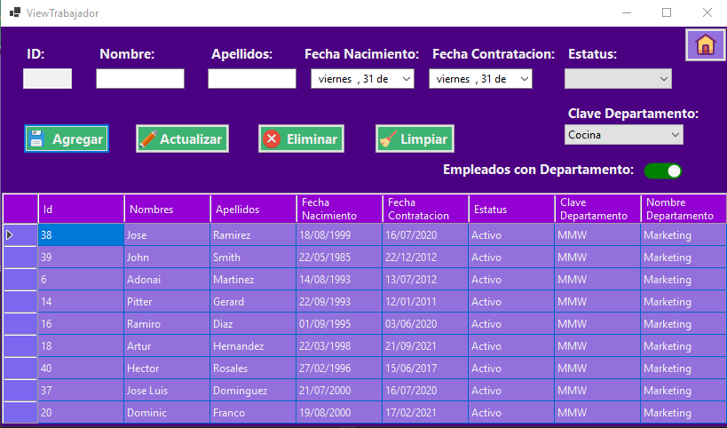
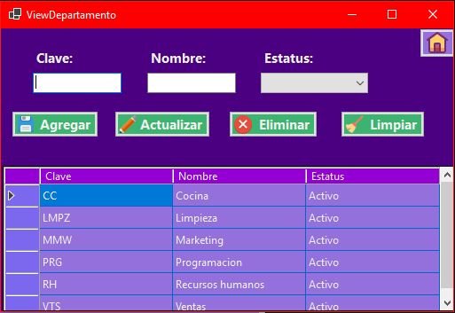
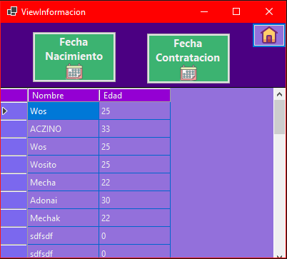

# CRUD
## Example of a CRUD Application || Ejemplo de una aplicacion CRUD.

---
## English
```C#
string Greet = "Hello world, my name is Alfredo and this is one of my proyects";

```

> In this proyect I did an application in C# and this are the different actions that will be do.

* Create a register in a Database Sql.
    * Create *workers* and *departments*.
* Read information of tables from Database.
    * Show information of *workers*, *departments* and *specify information*.
* Update register from Database.
    * Update *workers* and *departments*.
* Delete registers from Database.
    * Update an field that made  don't show registers.
---
## Español
~~~ C#
string Saludar = "Hola mundo, mi nombre es Alfredo y este es uno de mis proyectos";
~~~

> En este proyecto hice una aplicacion en C# y estos son las diferentes acciones que deberia hacer. 

* Crear un registro en una Base de datos de Sql.
    * Crear *trabajadores* y *departamentos*.
* Leer informacion de las tablas de la base de datos.
    * Ver informacion of *trabajadores*, *departmentos* y *informacion especifica*.
* Actualizar registros de la base de datos.
    * Actualizar *trabajadores* y *departmentos*.
* Eliminar registros de la base de datos.
    * Actualizar un campo que hace no se muestren los resultados.

## Showing Windows || Mostrando Ventanas
### Home || Inicio

In this window show buttons, this buttons direct to another windows.

En esta bentana se muestran botones, que dirigen a otras ventanas. 



### Worker || Trabajador

In this window show a table where can see different data, in this window can do different actions: **Create**, **Read**, **Update** and **Delete**

En esta ventana se muestra una tabla donde se pueden ver defrente informacion, en esta ventana se puede hacer diferentes acciones: **Crear**, **Leer**, **Actualizar** y **Eliminar**



### Departament || Departamento

In this window show a table where can see data and do different actions: **CRUD**.

En esta ventana se muestra una tabla donde se puede ver los registros de la base de datos y se puede hacer diferentes acciones: **CRUD**.



### Information || Informacion

In this window show a table with information specific like how many years have a worker, days working in the departament.

En esta ventana se muestra una tabla con informacion especifica como , cuantos que edad tiene un trabajador, dias trabajando en el departamento.



## **About me** || **Acerca de mi**

> :wink: Do you want contact me? Check my profile in [LinkedIn](https://www.linkedin.com/in/alfredo-rodríguez-orenday-73a14a215/ "Alfredo Rdz O")  

> :wink: ¿Quieres contactarme? Checa mi perfil en [LinkedIn](https://www.linkedin.com/in/alfredo-rodríguez-orenday-73a14a215/ "Alfredo Rdz O")  